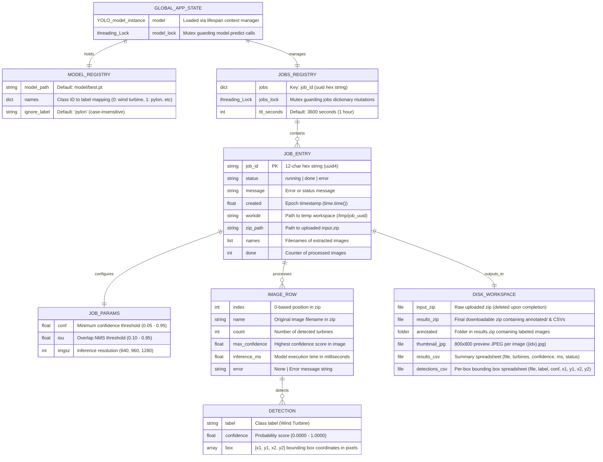

# Comprehensive System Architecture: Wind Turbine Spotter

This document presents the operational system architecture of the **Wind Turbine Spotter** application, specifically detailing client-side interactions, server-side processing steps, bulk async processing pipelines, storage mechanisms, and thread concurrency management in a horizontal layout.

---

## 1. High-Level System Architecture (Client-Side vs. Server-Side - Horizontal Layout)

```mermaid
flowchart LR
    classDef client fill:#0f172a,stroke:#38bdf8,stroke-width:2px,color:#f8fafc
    classDef serverCore fill:#064e3b,stroke:#34d399,stroke-width:2px,color:#ecfdf5
    classDef modelLayer fill:#312e81,stroke:#818cf8,stroke-width:2px,color:#e0e7ff
    classDef storageLayer fill:#701a75,stroke:#f0abfc,stroke-width:2px,color:#fdf4ff
    classDef azureLayer fill:#451a03,stroke:#fb923c,stroke-width:2px,color:#fff7ed

    subgraph CLIENT_SIDE[" CLIENT SIDE (Browser SPA - HTML5 / JS / Canvas) "]
        direction TB
        UI_LOAD["1. User opens App (GET /)<br/>Receives Single-File HTML/CSS/JS"]:::client
        UI_EVENT["2. Drag & Drop or File Select<br/>(Image or ZIP archive)"]:::client
        UI_PREVIEW["3. Client Canvas Render<br/>Displays local image preview & options"]:::client
        
        subgraph CLIENT_MODES[" Client Execution Modes "]
            MODE_SINGLE["Single Image Path:<br/>Construct FormData & POST /predict"]:::client
            MODE_ZIP["ZIP Bulk Path:<br/>Validate .zip extension & POST /predict_zip"]:::client
        end

        UI_POLL["4. Client Polling Loop (ZIP mode)<br/>Polls GET /jobs/{job_id} every 1s"]:::client
        UI_RENDER_SINGLE["5A. Client Overlay Canvas Drawing<br/>Draws bounding boxes & labels live"]:::client
        UI_RENDER_ZIP["5B. Client Gallery & Progress Bar<br/>Renders thumbnails & Download ZIP link"]:::client
    end

    subgraph SERVER_SIDE[" SERVER SIDE (Azure Container Apps / FastAPI Engine) "]
        direction LR

        subgraph CONTAINER_STARTUP[" Startup & Initialization "]
            direction TB
            D_SCRIPT["src/download_model.py"]:::serverCore
            CHECK_LOCAL{"Check model/best.pt<br/>on disk?"}:::serverCore
            FASTAPI_LIFESPAN["FastAPI Lifespan Manager<br/>Loads YOLO(MODEL_PATH) into memory state"]:::serverCore
        end

        subgraph FASTAPI_ROUTER[" FastAPI Web Server (Uvicorn ASGI) "]
            direction TB
            ROUTE_INFO["GET /info<br/>Returns Model Metadata & Zip Limits"]:::serverCore
            ROUTE_PREDICT["POST /predict<br/>Single Image Inference Handler"]:::serverCore
            ROUTE_PREDICT_ZIP["POST /predict_zip<br/>Bulk Zip Job Initiator"]:::serverCore
            ROUTE_JOB_STATUS["GET /jobs/{id}<br/>Job Status & Rows Endpoint"]:::serverCore
            ROUTE_JOB_IMG["GET /jobs/{id}/image/{idx}<br/>Thumbnail Server"]:::serverCore
            ROUTE_JOB_DL["GET /jobs/{id}/download<br/>Serves final results.zip"]:::serverCore
        end

        subgraph CONCURRENCY_MODEL[" Model Mutex Guard & Thread Pool "]
            direction TB
            MUTEX[["model_lock (threading.Lock)<br/>Enforces Single-Threaded Model Inference"]]:::modelLayer
            YOLO_PREDICT["YOLO.predict(image, conf, iou, imgsz)<br/>Runs Object Detection"]:::modelLayer
            FILTER_PYLON["Post-Processing Filter<br/>Ignores detections with 'pylon' label"]:::modelLayer
        end

        subgraph ASYNC_ZIP_ENGINE[" Background Daemon Worker Thread "]
            direction TB
            BG_THREAD["Background Thread (run_job)<br/>Executes asynchronously"]:::serverCore
            ZIP_UNPACK["Extract & Validate Images from input.zip"]:::serverCore
            ANNOTATE_ENGINE["Pillow ImageDraw Engine<br/>Draws bounding boxes & builds thumbnail"]:::serverCore
            CSV_GENERATOR["CSV Writer<br/>Generates results.csv & detections.csv"]:::storageLayer
            ZIP_PACKER["ZipFile Writer<br/>Compiles annotated images + CSVs to results.zip"]:::storageLayer
        end

        subgraph MEMORY_AND_DISK[" State Management & Ephemeral Disk "]
            direction TB
            JOB_DICT["In-Memory jobs Dictionary<br/>Thread-safe under jobs_lock"]:::storageLayer
            JOB_CLEANUP["cleanup_jobs Routine<br/>Evicts jobs older than 3600s"]:::storageLayer
            TEMP_DISK["Container Temp Directory (/tmp/job_uuid)<br/>Stores input.zip, thumbnails, results.zip"]:::storageLayer
        end
    end

    subgraph AZURE_CLOUD[" AZURE CLOUD PLATFORM "]
        direction TB
        AZ_FETCH["Fetch blob via Azure Blob SDK<br/>(models/turbine_v10/best.pt)"]:::azureLayer
        BLOB_STORE[("Azure Blob Storage<br/>Container: wind-turbine-data")]:::azureLayer
    end

    %% Startup Flow
    D_SCRIPT --> CHECK_LOCAL
    CHECK_LOCAL -- "No" --> AZ_FETCH
    AZ_FETCH --> BLOB_STORE
    CHECK_LOCAL -- "Yes" --> FASTAPI_LIFESPAN
    AZ_FETCH -- "Write model/best.pt" --> FASTAPI_LIFESPAN

    %% Client to Server Route Mapping
    UI_LOAD --> ROUTE_INFO
    UI_EVENT --> UI_PREVIEW
    UI_PREVIEW --> MODE_SINGLE
    UI_PREVIEW --> MODE_ZIP

    MODE_SINGLE -- "Multipart Request" --> ROUTE_PREDICT
    MODE_ZIP -- "ZIP Payload Upload" --> ROUTE_PREDICT_ZIP

    %% Single Image Server Flow
    ROUTE_PREDICT --> MUTEX
    MUTEX --> YOLO_PREDICT
    YOLO_PREDICT --> FILTER_PYLON
    FILTER_PYLON -- "Return JSON (Count, ms, boxes)" --> UI_RENDER_SINGLE

    %% ZIP Server Flow
    ROUTE_PREDICT_ZIP --> JOB_CLEANUP
    ROUTE_PREDICT_ZIP --> TEMP_DISK
    ROUTE_PREDICT_ZIP --> BG_THREAD
    ROUTE_PREDICT_ZIP -- "Immediate Response (job_id, total)" --> UI_POLL

    BG_THREAD --> ZIP_UNPACK
    ZIP_UNPACK --> MUTEX
    ANNOTATE_ENGINE --> TEMP_DISK
    FILTER_PYLON --> ANNOTATE_ENGINE
    BG_THREAD --> CSV_GENERATOR
    CSV_GENERATOR --> ZIP_PACKER
    ZIP_PACKER --> TEMP_DISK
    BG_THREAD --> JOB_DICT

    %% Polling and Download Flow
    UI_POLL -- "GET status" --> ROUTE_JOB_STATUS
    ROUTE_JOB_STATUS --> JOB_DICT
    UI_POLL -- "GET Thumbnail" --> ROUTE_JOB_IMG
    ROUTE_JOB_IMG --> TEMP_DISK
    UI_POLL -- "Finished" --> UI_RENDER_ZIP
    UI_RENDER_ZIP -- "GET /jobs/{id}/download" --> ROUTE_JOB_DL
    ROUTE_JOB_DL --> TEMP_DISK
```

---

## 2. Detailed Bulk Processing Pipeline (`POST /predict_zip` - Horizontal Layout)

```mermaid
flowchart LR
    classDef client fill:#0f172a,stroke:#38bdf8,stroke-width:2px,color:#f8fafc
    classDef apiRoute fill:#064e3b,stroke:#34d399,stroke-width:2px,color:#ecfdf5
    classDef validation fill:#7c2d12,stroke:#fb923c,stroke-width:2px,color:#ffedd5
    classDef bgWorker fill:#312e81,stroke:#818cf8,stroke-width:2px,color:#e0e7ff
    classDef modelMutex fill:#831843,stroke:#f472b6,stroke-width:2px,color:#fce7f3
    classDef diskStorage fill:#701a75,stroke:#f0abfc,stroke-width:2px,color:#fdf4ff

    subgraph CLIENT_INTERFACE[" 1. CLIENT / USER INTERACTION "]
        direction TB
        ZIP_INPUT["User Selects or Drops ZIP File<br/>(Browser UI)"]:::client
        HTTP_POST["HTTP POST /predict_zip<br/>Params: file, conf, iou, imgsz"]:::client
    end

    subgraph INGESTION_VALIDATION[" 2. INGESTION & VALIDATION ROUTE (POST /predict_zip) "]
        direction TB
        CLEANUP_TRIGGER["Trigger cleanup_jobs()<br/>Purge jobs older than 3600s"]:::apiRoute
        MK_TEMP["Create Temp Workspace<br/>tempfile.mkdtemp(prefix='job_') -> /tmp/job_uuid"]:::diskStorage
        STREAM_WRITE["Stream Request Body to input.zip"]:::diskStorage
        
        CHK_SIZE{"Check total ZIP size<br/>(size > MAX_ZIP_MB 200MB?)"}:::validation
        REJECT_413["Reject HTTP 413 Payload Too Large<br/>Cleanup temp directory"]:::validation
        
        CHK_ZIP_VALID{"zipfile.is_zipfile()<br/>Valid Archive?"}:::validation
        REJECT_BAD_ZIP["Reject HTTP 400 Bad Request<br/>Invalid ZIP structure"]:::validation
        
        LIST_ENTRIES["list_image_entries(zf)<br/>Filter valid extensions: .jpg, .png, .webp, .bmp, .tif<br/>Ignore hidden/Mac files (__MACOSX, .DS_Store)"]:::apiRoute
        
        CHK_EMPTY{"No valid images found?"}:::validation
        REJECT_NO_IMAGES["Reject HTTP 400 Bad Request<br/>No readable images in ZIP"]:::validation
        
        CHK_IMAGE_LIMIT{"Image Count > MAX_ZIP_IMAGES (300)?"}:::validation
        REJECT_TOO_MANY["Reject HTTP 400 Bad Request<br/>Exceeds 300 images limit"]:::validation

        INIT_JOB_OBJECT["Generate job_id (uuid.uuid4().hex[:12])<br/>Initialize Job State dict (status='running', done=0)<br/>Store in global jobs dictionary with jobs_lock"]:::apiRoute
        SPAWN_THREAD["Spawn Daemon Thread<br/>threading.Thread(target=run_job, args=(job_id,), daemon=True).start()"]:::bgWorker
        RESPOND_200["Return Immediate JSON Response<br/>{'job_id': job_id, 'total': total_count}"]:::apiRoute
    end

    subgraph BACKGROUND_ENGINE[" 3. ASYNC BACKGROUND DAEMON ENGINE (run_job) "]
        direction TB
        OPEN_ZIPS["Open input.zip (read) and results.zip (write ZIP_STORED)"]:::bgWorker
        
        subgraph LOOP_PER_IMAGE[" Per-Image Processing Loop (for idx, name in enumerate(names)) "]
            direction TB
            CHK_SINGLE_SIZE{"Image Size > MAX_IMAGE_MB (50MB)?"}:::validation
            FLAG_SIZE_ERR["Record Row Error:<br/>'Larger than 50 MB'"]:::validation
            
            READ_IMAGE["Read Byte Stream & Convert to RGB via Pillow"]:::bgWorker
            CHK_READ_ERR{"Image Reading Exception?<br/>UnidentifiedImageError / OSError"}:::validation
            FLAG_READ_ERR["Record Row Error:<br/>'Not a readable image'"]:::validation
            
            subgraph INFERENCE_GUARD[" Model Inference Execution "]
                ACQUIRE_LOCK[["Acquire model_lock (threading.Lock)"]]:::modelMutex
                YOLO_EXEC["model.predict(image, conf, iou, imgsz)"]:::modelMutex
                RELEASE_LOCK[["Release model_lock"]]:::modelMutex
                FILTER_CLASS["Filter Out 'pylon' Label Detections<br/>Sort by confidence descending"]:::modelMutex
            end
            
            ANNOTATE_IMG["annotate(image, detections)<br/>Draw bounding boxes (BOX_COLOR = #FFC15E)<br/>Draw confidence labels with DejaVuSans font"]:::bgWorker
            GEN_THUMB["Generate Thumbnail<br/>thumb = annotated.copy()<br/>thumb.thumbnail((800, 800))"]:::bgWorker
            
            SAVE_FULL["Write full annotated JPEG to results.zip<br/>Path: annotated/0001_filename.jpg (quality 88)"]:::diskStorage
            SAVE_THUMB["Write thumbnail JPEG to disk<br/>Path: /tmp/job_uuid/0000.jpg (quality 80)"]:::diskStorage
            UPDATE_ROW["Append Row to job['rows']<br/>Update job['done'] = idx + 1"]:::bgWorker
        end
        
        WRITE_CSV_RESULTS["write_csvs(): Build results.csv<br/>file, turbines, max_confidence, inference_ms, status"]:::diskStorage
        WRITE_CSV_DETECTIONS["write_csvs(): Build detections.csv<br/>file, label, confidence, x1, y1, x2, y2"]:::diskStorage
        MARK_DONE["Set job['status'] = 'done'<br/>Remove temp input.zip"]:::bgWorker
        CATCH_FAIL["If unexpected crash:<br/>Set job['status'] = 'error'"]:::validation
    end

    subgraph CLIENT_POLLING_DOWNLOAD[" 4. CLIENT POLLING & DOWNLOAD STAGE "]
        direction TB
        POLL_STATUS["GET /jobs/{job_id}<br/>Reads job['done'], total, turbines count, rows"]:::client
        FETCH_THUMB["GET /jobs/{job_id}/image/{idx}<br/>Serves thumbnail image /tmp/job_uuid/{idx}.jpg"]:::client
        DOWNLOAD_ZIP["GET /jobs/{job_id}/download<br/>Serves /tmp/job_uuid/results.zip as turbine_results.zip"]:::client
    end

    %% Flow Connectors
    ZIP_INPUT --> HTTP_POST
    HTTP_POST --> CLEANUP_TRIGGER
    CLEANUP_TRIGGER --> MK_TEMP
    MK_TEMP --> STREAM_WRITE
    STREAM_WRITE --> CHK_SIZE
    
    CHK_SIZE -- Yes --> REJECT_413
    CHK_SIZE -- No --> CHK_ZIP_VALID
    
    CHK_ZIP_VALID -- No --> REJECT_BAD_ZIP
    CHK_ZIP_VALID -- Yes --> LIST_ENTRIES
    
    LIST_ENTRIES --> CHK_EMPTY
    CHK_EMPTY -- Yes --> REJECT_NO_IMAGES
    CHK_EMPTY -- No --> CHK_IMAGE_LIMIT
    
    CHK_IMAGE_LIMIT -- Yes --> REJECT_TOO_MANY
    CHK_IMAGE_LIMIT -- No --> INIT_JOB_OBJECT
    
    INIT_JOB_OBJECT --> SPAWN_THREAD
    INIT_JOB_OBJECT --> RESPOND_200
    RESPOND_200 --> POLL_STATUS

    SPAWN_THREAD --> OPEN_ZIPS
    OPEN_ZIPS --> CHK_SINGLE_SIZE
    
    CHK_SINGLE_SIZE -- Yes --> FLAG_SIZE_ERR
    FLAG_SIZE_ERR --> UPDATE_ROW
    
    CHK_SINGLE_SIZE -- No --> READ_IMAGE
    READ_IMAGE --> CHK_READ_ERR
    
    CHK_READ_ERR -- Yes --> FLAG_READ_ERR
    FLAG_READ_ERR --> UPDATE_ROW
    
    CHK_READ_ERR -- No --> ACQUIRE_LOCK
    ACQUIRE_LOCK --> YOLO_EXEC
    YOLO_EXEC --> RELEASE_LOCK
    RELEASE_LOCK --> FILTER_CLASS
    FILTER_CLASS --> ANNOTATE_IMG
    ANNOTATE_IMG --> GEN_THUMB
    GEN_THUMB --> SAVE_FULL
    SAVE_FULL --> SAVE_THUMB
    SAVE_THUMB --> UPDATE_ROW

    UPDATE_ROW --> WRITE_CSV_RESULTS
    WRITE_CSV_RESULTS --> WRITE_CSV_DETECTIONS
    WRITE_CSV_DETECTIONS --> MARK_DONE
    MARK_DONE --> DOWNLOAD_ZIP
    OPEN_ZIPS -.-> CATCH_FAIL

    POLL_STATUS --> FETCH_THUMB
```

---

## 3. Comprehensive Data & State Model (ERD)

